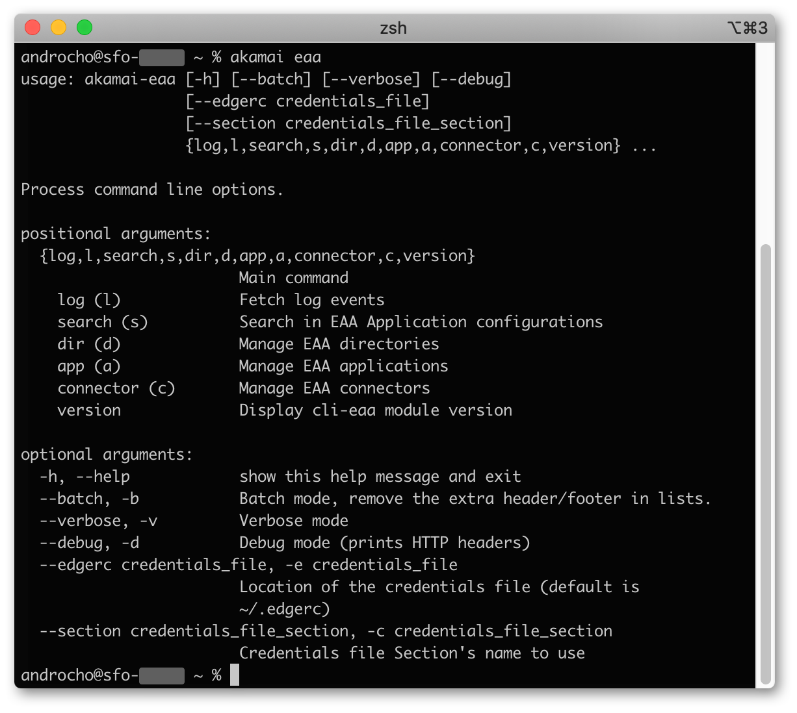

# Akamai CLI: Enterprise Application Access<!-- omit in toc -->

## Table of contents<!-- omit in toc -->

- [Screenshot](#screenshot)
- [Introduction](#introduction)
- [Key features](#key-features)
- [Installation / upgrade](#installation--upgrade)
- [Examples](#examples)
  - [EAA event logs](#eaa-event-logs)
  - [Applications](#applications)
  - [Directory operations](#directory-operations)
  - [Connectors](#connectors)
    - [Swapping connectors](#swapping-connectors)
  - [Certificate management](#certificate-management)
  - [Device Posture Inventory](#device-posture-inventory)
- [Known Limitations](#known-limitations)
- [Troubleshooting and Support](#troubleshooting-and-support)
  - [Self-troubleshooting](#self-troubleshooting)
  - [Support](#support)

## Screenshot



## Introduction

[Enterprise Application Access (EAA)](https://www.akamai.com/us/en/products/security/enterprise-application-access.jsp) comes with a full suite of APIs. 
Yet you need to write scripts or use [Postman](https://developer.akamai.com/authenticate-with-postman) to be able to interact with the service.

With [Akamai CLI](https://developer.akamai.com/cli) you can run very common operations directly from the command line, no coding required. 

This can be helpful if you plan to consume EAA logs into your favorite SIEM, or automate some operation in your workflow with Bash, Powershell or solution like Ansible.

## Key features

- Event logs
  - View access logs (identification, application activity)
  - View admin logs (admin portal access, config change, deployment, deletion)
  - Send the logs to a file
  - Blocking mode (similar to `tail -f`)
  - Alternatively, you can specify a date range with `--start` and `--end`
- Application
  - Save, restore/update, deploy
  - Batch operation
  - Attach/detach connectors
- Directory
  - Create group and group overlay
  - Synchronize with your LDAP or Active Directory
- Identity Providers (IdP)
  - List configured IdP, status
- Certificate management
  - List configured certificates
  - Rotate certificate with optional deployment of dependent applications and IdP
- Connectors
  - List all connectors including the reachability status and health
  - Show all applications used by a connector and breakdown of active connection
  - Swap a connector (limited to applications only)

## Installation / upgrade

See [install.md](docs/install.md)

## Examples

### EAA event logs

EAA has two types of logs, the user access logs and the administrators audit logs.
For detailed description about each field, please refer to the product documentation on [https://learn.akamai.com](https://learn.akamai.com/en-us/webhelp/enterprise-application-access/eaa-logs-from-eaa-api-and-splunk/GUID-07D6B02C-1EDE-4D16-A19D-687449B4A748.html).

You can pull EAA events either:
- in near realtime using the argument `-f` or `--tail`
- or retrieve a period of time passing EPOCH timestamp in `--start` and `--end`

If you set `-f` and date range, the `-f` option will be ignored.

Pull user access logs, block till new logs are received.
You can stop by pressing Control+C (Control+Break) or sending a signal SIG_INT or SIG_TERM to the process

```bash
$ akamai eaa log access --tail
```

You may want a one time chunk of log for a period of time, let's say the last 6 hours:

```bash
$ START=$(bc <<< "$(date +%s) - 6 * 60 * 60")
$ akamai eaa log access -s $START
```

On Windows platforms, you may use PowerShell
```powershell
PS /home/cli-eaa> $START = (Get-Date -UFormat %s) - 6 * 60 * 60
PS /home/cli-eaa> akamai eaa log access -s $START
```

Send the **user access events** to a file (utf-8 encoding is being used):
```bash
$ akamai eaa log access --tail -o /tmp/eaa_access.log
```

Pull **admin audit events**, block till new logs are received
```bash
$ akamai eaa log admin --tail
```

### Applications

```
$ akamai eaa search datascience
app://mD_Pw1XASpyVJc2JwgICTg,Data Science,akdemo-datascience,akdemo-datascience.go.akamai-access.com,4
Found 1 app(s), total 124 app(s)
```

You can save locally the application
```
$ akamai eaa app app://mD_Pw1XASpyVJc2JwgICTg > ~/eaa_app_datascience_v3.json
```

And restore
```
$ cat ~/eaa_app_datascience_v3.json | akamai eaa app app://mD_Pw1XASpyVJc2JwgICTg update
```

Or quickly walk through the JSON tree with `jq`.
```
$ akamai eaa -b app app://mD_Pw1XASpyVJc2JwgICTg | jq .advanced_settings.websocket_enabled
"true"
```

Delete an application
```
akamai eaa app app://mD_Pw1XASpyVJc2JwgICTg delete
```

Deploy an application, you can optionally add a comment to keep track of the change:
```
akamai eaa app app://mD_Pw1XASpyVJc2JwgICTg deploy --comment "[TICKET1234] Update service account credentials"
```


One question we often get: *What are the applications using connector `xyz`?*\
Buckle up, we use `jq` and `grep`.\
Note: we use `-b` to avoid the extra info the CLI spills out, like the footer.

```
$ akamai eaa -b search | akamai eaa app - | jq -j '.name, ": ", (.agents[]|.name, " "), "\n"'|grep xyz
```

View groups associated with a particular application
```
$ akamai eaa app app://FWbUCfpvRKaSOX1rl0u55Q viewgroups
```

You can pipe command as well, example to deploy all the application matching "bastion"

```
$ akamai eaa -b search bastion | akamai eaa app - deploy
```

Attach/detach connectors to a particular application:

```
$ akamai eaa app app://app-uuid-1 attach con://connector-uuid-1 con://connector-uuid-2
$ akamai eaa app app://app-uuid-1 detach con://connector-uuid-1 con://connector-uuid-2
```

### Directory operations

List the configured directories

```
$ akamai eaa dir
dir://FuiibQiDQzmC34oBx7INfQ,Cloud Directory,7
dir://2Kz2YqmgSpqT_IJq9BLkWg,ad.akamaidemo.net,108
dir://EX5-YjMyTrKgeWKHrqhUEA,Okta LDAP,10
dir://Ygl1BpAFREiHrA8HR7dFhA,Azure AD,1
```

Trigger directory synchronization

```
$ akamai eaa dir dir://2Kz2YqmgSpqT_IJq9BLkWg sync
Synchronize directory 2Kz2YqmgSpqT_IJq9BLkWg
Directory 2Kz2YqmgSpqT_IJq9BLkWg synchronization requested.
```

### Connectors

Here with the shortcut `c` and the `column` command available in most POSIX environment.
When piping, the extra information written on *stderr* so they appear seperately.
Below short command `akamai eaa c` short form for `akamai eaa connector list`:

```
$ akamai eaa c | column -t -s,
Total 9 connector(s)
#Connector-id                 name                reachable  status  version     privateip      publicip        debug
con://cht3_GEjQWyMW9LEk7KQfg  demo-v2-con-1-amer  1          1       4.4.0-2765  10.1.4.206     12.123.123.123  Y
con://Wy0Y6FrwQ66yQzLBAInC4w  demo-v2-con-2-amer  1          1       4.4.0-2765  10.1.4.172     12.123.123.123  Y
con://dK0f1UvhR7i8-RByABDXaQ  demo-v2-con-4-emea  1          1       4.4.0-2765  192.168.1.90   12.123.12.12    N
con://Ihmf51dASo-R1P37hzaP3Q  demo-v2-con-3-emea  1          1       4.4.0-2765  192.168.1.235  12.123.12.12    N
con://XiCmu80xQcSWnaeQcvH8Vg  demo-v2-con-5-apj   1          1       4.4.0-2765  192.168.1.228  12.123.123.12   Y
con://pkGjL5OgSjyHoymMguvp9Q  demo-v2-con-6-apj   1          1       4.4.0-2765  192.168.1.144  12.123.123.12   Y
con://NAWSlptPSXOjq-bk2-EQPw  demo-v2-con-10-rus  1          1       4.4.0-2765  10.3.0.101     12.123.123.12   Y
con://e_0nShZBQ7esNAC3ZEkhSQ  demo-v2-con-3-amer  1          1       4.4.0-2765  10.1.4.83      12.123.123.123  Y
con://OEe9o-n2S_aMeZpLxgwG0A  tmelab-sfo          1          1       4.4.0-2765  192.168.2.101  12.123.123.12   Y
```

If you need to integrate connector health into your monitoring system, use the `--perf` option.
Command `akamai eaa c list --perf`
You will get 7 extra columns:
- CPU usage (%)
- Memory usage (%)
- Network Traffic (Mbps)
- Total of dialout connections
- Idle dialout connections
- Active dialout connections

To correlate with application served by each connectors, use the `--showapps`, a list of the application FQDNs as an array in the JSON response.

#### Swapping connectors

If you are doing a maintenance on an hypervizor, you may need to swap out 2 connectors.
The current implement look for all the apps, add the new connector, remove the old one.
The application is marked as ready to update.

Caveats (let us know if you need it):
- This doesn't perform swap for directory
- There is no option to automatically redeploy the impacted application after the swap

Example:
```
$ akamai eaa connector con://e_0nShZBQ7esNAC3ZEkhSQ swap con://cht3_GEjQWyMW9LEk7KQfg
#Operation,connector-id,connector-name,app-id,app-name
+,con://cht3_GEjQWyMW9LEk7KQfg,demo-v2-con-1-amer,app://nSFDNGYARHeZGNlweIX7Wg,Speedtest (v2.1)
-,con://e_0nShZBQ7esNAC3ZEkhSQ,demo-v2-con-3-amer,app://nSFDNGYARHeZGNlweIX7Wg,Speedtest (v2.1)
Connector swapped in 1 application(s).
Updated application(s) is/are marked as ready to deploy
```

### Certificate management

One of the most common task with certificate it to rotate before the current certificate expires.
cli-eaa helps with this task with the `akamai eaa certificate` command. 

You simply pass the certificate  and key file as parameter, the optional passphrase and the 
command will replace the existing certificate.
By default, the rotation won't redeploy the impacted application / IdP. If you want the cli to trigger the
deployment of all impacted applications and IdP, add the ``--deployafter``.

Example using `--deployafter`:
```
$ akamai eaa certificate crt://certificate-UUID rotate --key ~/certs/mycert.key --cert ~/certs/mycert.cert --deployafter
Rotating certificate certificate-UUID...
Certificate CN: *.akamaidemo.net (*.akamaidemo.net Lets Encrypt)
Certificate certificate-UUID updated, 3 application/IdP(s) have been marked ready for deployment.
Deploying application Multi-origin Active-Active Demo (US-East) (app://appid-1)...
Deploying application Multi-origin Active-Active Demo (US-West) (app://appid-2)...
Deploying IdP Bogus IdP to test EME-365 (idp://idpid-1)...
Deployment(s) in progress, it typically take 3 to 5 minutes
Use 'akamai eaa cert crt://certificate-UUID status' to monitor the progress.
```

Checking the status of the deployment:

```bash
$ akamai eaa cert crt://certificate-UUID status
#App/IdP ID,name,status
app://appid-1,Multi-origin Active-Active Demo (US-East),Pending
app://appid-2,Multi-origin Active-Active Demo (US-West),Pending
idp://idpid-1,Bogus IdP to test EME-365,Pending
```

### Device Posture Inventory

Pipe the result of the inventory into `jq` to display only device ID, name and user_id

```bash
$ akamai eaa dp inventory | jq '.[] | {device_id, device_name, user_id}'
```

## Known Limitations

- While updating an application from a JSON, only a subset of the data will be updated in the back-end, not the entire application configuration

## Troubleshooting and Support

### Self-troubleshooting

If the command is not working properly, you can increase the level of verbosity using:

- `-v` or `--verbose` to trace the main steps
- `-d` or `--debug` to get full visibility, include API HTTP headers

The messages are printed on _stderr_ so you can safely redirect stdout to a file or use the `--output` option.

### Support

`cli-eaa` is provided as-is and it is not supported by Akamai Support.
To report any issue, feature request or bug, please open a new issue into the [GitHub Issues page](https://github.com/akamai/cli-eaa/issues)

We are strongly encouraging developer to create a pull request.
